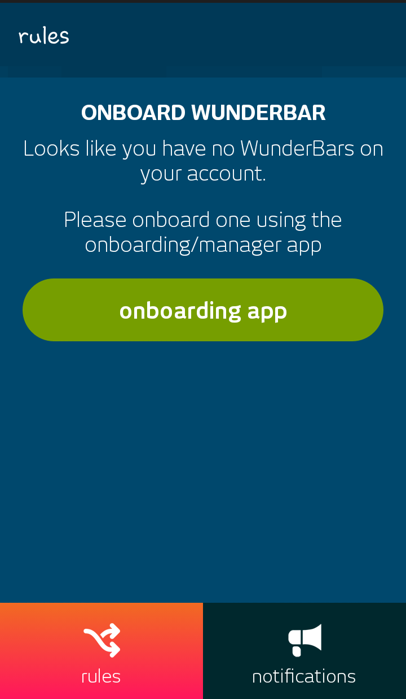
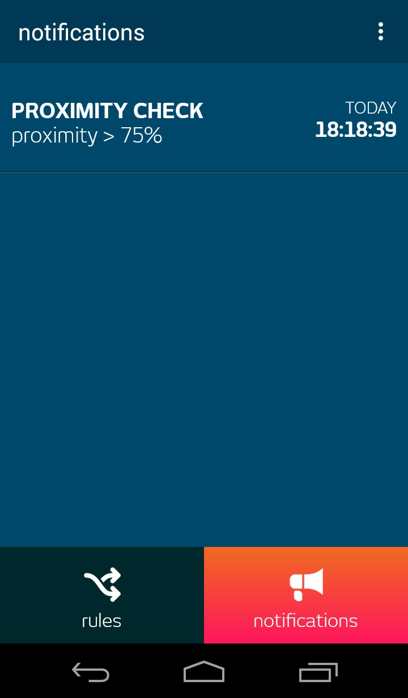

# TellMeWhen	

TellMeWhen is a fun and easy to use application which notifies you when a certain threshold has been reached or passed, based on rules you create yourself. It utilizes the relayr [WunderBar](https://relayr.io/wunderbar) sensors which gather information about temperature, humidity, light, proximity and noise levels. Just choose the measurement types you wish to be notified about, set a respective threshold and get notified whenever a threshold is exceeded. It's as simple as that!

TellMeWhen is an open source application, so you are more than welcome to download this repository and implement the code in your own Android or iOS / OSX projects.

PLEASE NOTE: The purpose of this application is to exemplify a useful and easy-to-implement manner of utilizing the WunderBar sensor modules. It is in no way intended for use in mission critical or life critical situations. Furthermore, delivery of push notifications cannot be guaranteed as they rely on the up-time and functionality of services external to the relayr platform.

For information about our sensors, have a look at our [Making Sense of Sensors](https://developer.relayr.io/documents/Welcome/Sensors) page.

The app is available for download from the Google Play store at [this](https://play.google.com/store/apps/details?id=io.relayr.tellmewhen) link

### 1. Logging in

Start by logging in with your relayr credentials

In case you do not have any WunderBars registered on your account you will be prompted to register one

### Setting up Rules

Setting up rules is as easy as three taps. 

	

Start by selecting your WunderBar (in the event that you have multiple ones onboarded)

Next, select the sensor you would like to set the rule for

Set up a threshold for the notification

Give your rule a meaningful name

And you are done!

### 2. Enabling Notifications

Turn on notifications for the different rules created

### 3. Viewing Notifications 

You are able to view your notifications history 

As well as the details of each of the notifications

